# Node-RED-HA-Solcast-JSONata

[](https://github.com/oatybiscuit/Node-RED-HA-Solcast-JSONata/releases)

[](/LICENSE)

[](https://nodered.org/)
[](https://jsonata.org/)
[](https://www.solcast.com/)
[](https://www.home-assistant.io/)

A **Node-RED** flow to read, analyze and save into context **Solcast Solar API forecasts** using **JSONata**. Manage one or two solar planes in a Solcast Home-User account and store forecast with actual production history for up to five days including yesterday, today, and tomorrow. Ability to create sensors in **Home Assistant** for current power forecast and total energy forecasts for today and tomorrow, with potential for use and display in graphs and automations.

>[!NOTE]
> I am not connected in any way with Solcast. There are other interpretations for the details of the data returned from the API.

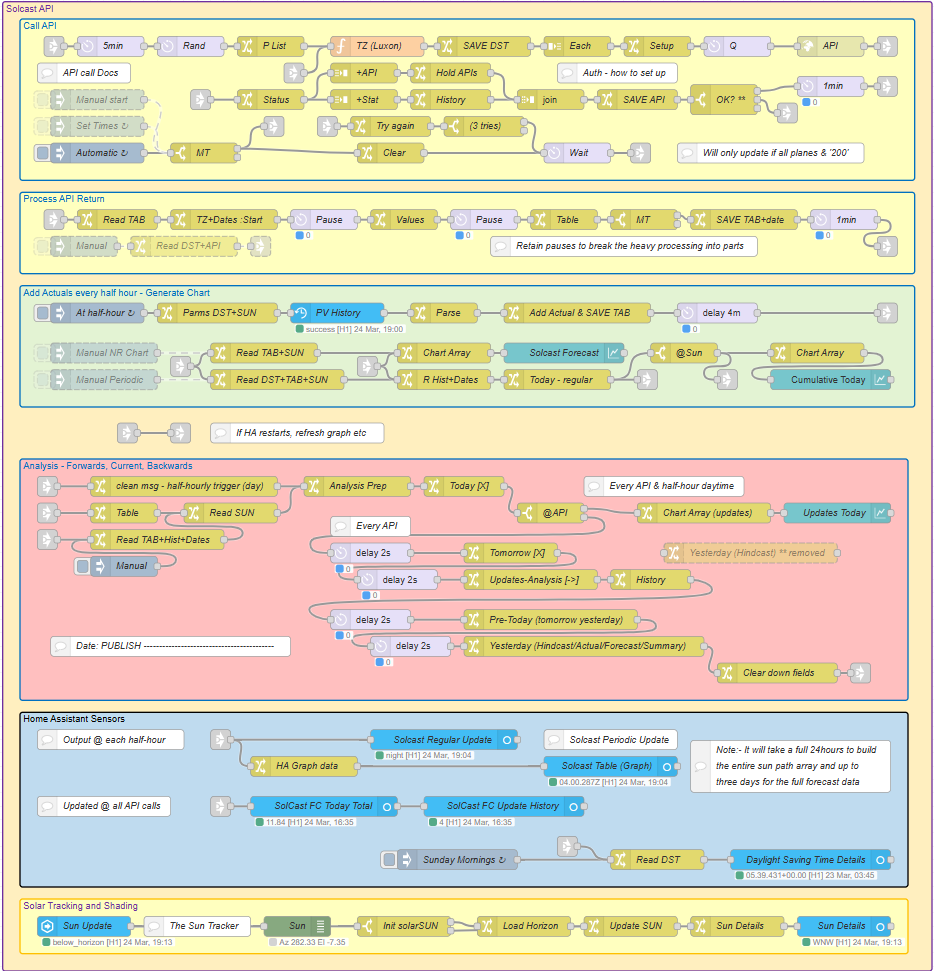

>[!CAUTION]
> This flow is partly experimental, with a view to obtaining detailed information from Solcast API calls, and to find how to improve a reliable match between forecast and actual solar production. Some parts of the flow remain experimental, notably shading. The arrangement obtains, holds, and analyses as much detail as possible, well beyond a simple 'solar forecast for today'. This flow works, and provides a 90-105% match during most of the year for my own arrangement. This may not be suitable for your own purposes or situation.

:

>[!WARNING]
> This flow uses JSONata to process the large and complex arrays of data involved. JSONata is a powerful language for processing JSON structures, but it sacrifices efficiency for simplicity. Since Node-RED is single-thread, processing the API call return can take several seconds, and **this will block all other Node-RED processing while this happens**. This is more noticeable at the peak of the solar year where the solar day is longer than 14 hours. **This code should be used with care on the same Node-RED instance as other highly time-critical applications.** The component parts of the processing have been separated into individual nodes with smaller tasks and delay breaks between, so as to mitigate the effect. API calls should be timed where possible to avoid other significant activity.

## TL;DR (quick start guide)

- Make sure you have **Node-RED working**.
- Obtain a **Hobbyist account with Solcast**, configure your one or two planes, and obtain the **plane resource codes and account API key**.
- **Download the release .json file and import** this directly into Node-RED.
- Change the settings:
  - **Configure the plane [P List node] and authorisation [API node] codes into the flow**.
  - Make sure you have your **timezone set** in either Node-RED as a Home Assistant add-on, or in the flow environment variable 'TZ'.  
  - Optionally, if you have a file-based context store, modify the context settings to use file rather than memory. See [can I save context over a restart](#questions-you-might-want-to-ask).
  - Optionally add your horizon settings for the shading calculator [Load Horizon] and set your plane(s) for the sun-path graph [Update SUN].  
- If you are using Home Assistant, **edit the sensors and sensor configuration nodes to enable them and set them with your home assistant server**. Also **configure the solar-power sensor** for solar PV history and enable both current state and events state nodes.
- If you are going to use the Node-RED graphs, the graph nodes will need to be enabled and the dashboard settings checked.
- Fire at least **one API forecast call manually to create and populate all the context variables**, and then configure the triggers for either your *fixed* or *automatic* times.

You will need to wait at least two full days for the context variables to populate for a full set of forecasts.

## What this Node-RED flow does

<details>
<summary> Flow action </summary>

This flow will:

- Trigger at fixed/calculated times to call the Solcast API for one or two solar planes, obtaining solar forecast and/or hind-cast figures for yesterday, today and tomorrow
  - calculating local timezone times and dates for the forecast period
  - maintaining context variable data objects with the returned forecast
  - analyzing the returned forecast for each day and for each API update call
  - providing for HA sensors for the forecast for today and tomorrow

- Update every half-hour to
  - record the actual solar production for each preceding half-hour period
  - update HA sensor with the last, current, and next hour and half-hour period forecast
  - provide graphing arrays for display in Node-RED an HA graphs and tables

- Regularly update a sun-tracking array
  - track sun elevation against azimuth
  - estimate horizon shading by half-hour period
  - modify the forecast depending on shading
  - provide graphing array for display of the sun track

</details>

## Prerequisites

> [!WARNING]
> If you are not comfortable running Node-RED then please do not attempt to use this code! This code uses JSONata throughout rather than function nodes and JavaScript. JSONata is a declarative-functional language. This may require more time and effort to understand, modify and debug the code *should you wish to make changes*.

<details>
<summary> Installation requirements </summary>

This is a **Node-RED** flow, written to run in Node-RED alongside Home Assistant. You will need:

- **Node-RED**, ideally running as a [Home Assistant add-on](https://github.com/hassio-addons/addon-node-red#readme)
- The API call *settings* for your own Solcast account (for the API Key and the Resource ID codes for each plane)
- If connecting back to Home Assistant, the [WebSocket nodes](https://github.com/zachowj/node-red-contrib-home-assistant-websocket) installed and their HA server configuration working correctly
- If recording actual solar production, a solar energy sensor in Home Assistant that tracks total energy produced (typically from your inverter)
- *No additional palette nodes are required*

</details>

## Solcast Forecast - good to know the 'how' and 'why'

<details>
<summary> Solcast and API calls </summary>

### Solcast

**Solcast** is a commercial organisation providing detailed solar PV forecasting services. As a community service, **Free Rooftop Solar Power Forecasts** are available to home owners.

This is a limited service [based on details at time of writing]. One hobbyist residential account may be registered with a maximum of two rooftop planes. **There is also a strict limit on the number of API calls that can be made during a 24 hour period**.

You can find out more and register here at >: [Solar Irradiance Data](https://solcast.com/free-rooftop-solar-forecasting).

To use the Solcast API service you will need to first register for home hobbyist access. Please ensure that you correctly and fully set up your account, your PV plane(s), and obtain the necessary API and resource codes.

### When to call the Solcast API

The flow maintains an array containing **240 half-hourly records** that can fully cover up to *five* days; being the *day-before-yesterday* (old), *yesterday*, *today*, *tomorrow*, and the *day-after-tomorrow* (future).

Solcast offer both *forecasts*, which return 96 half-hourly periods starting from and including *now*, and *estimates* (I call them *hind-casts*) which return 96 half-hourly periods going backwards from and including *now*.

Calling the estimate (hind-cast) between midnight and sunrise will therefore return historic records for a full coverage of both yesterday and the day-before-yesterday.

Calling the forecast at any point during a day will therefore return forecasts for a coverage of the remainder of today, all of tomorrow, and (if called after dawn) the first part of the day after tomorrow. If the forecast is called between sunset and midnight, the return will cover all of tomorrow and all of the day after tomorrow.

The 'estimates' are only used to obtain historic records (estimates of what actually happened) and if required this can be called at any point in the day. Calling just once and shortly after midnight (or any point before dawn) will provide not only yesterday, but also a full data set of history for the day-before-yesterday. There is no real benefit gained in calling for estimates more than once a day, and I find that there is almost no difference between the two sets of values returned for the-day-before-yesterday (obtained as the 'day-before-yesterday' @today, and previously obtained as 'yesterday' @yesterday). Estimates, if collected, provide a good way of evaluating the Solcast settings and performance, since they should compare accurately with your actual-history record.

The 'forecasts' can be called at any point during the day. The 'today forecast' will remain (as a stale value) past midnight until the first API call has been made in the new day. A forecast call must be made, for example prior to 02:00, if a forecast figure for today is required by that time. If the first API call of the day is for an 'estimate' then the today forecast figure will be cleared to 0 until the first 'forecast' call is made.

- Forecasts will change during the day, however frequent API calls may not be of practical use. Some experimentation may be required to decide the best calling times that suit your particular needs.
- Forecasts during the daylight period will only update the *remaining* half-hour periods, hence there is a diminishing value gained from forecast updates as the day progresses.

**The Solcast free-use hobby account permits up to a maximum of 10 API calls per account each day** [at the time of writing]. Each plane and each of 'forecast' and 'estimate' (hind-cast) counts as one API call. The day runs between 00:00 to 23:59 **UTC** and *not* local time. Exceeding the count limit will generate a call error.

**API calls may fail**, however the data array will continue to hold and use the most recent forecast, and the flow will continue to collect and store the hourly actual production figures if required. API failure is mostly due to Solcast applying *occasional* rate-limiting. In such cases status 429 is returned by the call, the call just made does not count against the account API limit, and the flow will attempt to repeat the API call up to three times.

Rate limiting will occur for genuine reasons if you have exceeded the call limit for the 24 hour period. Rate limiting due to excessive demand is rare. The flow has been coded to attempt up to three repeat calls, however at the time of writing this has not been fully tested.

To ease demand on the Solcast servers, to reduce the impact of running this code at the exact hour and half-hour, fixed and random delays are added in to the calling process. All calls are stepped out by 5 minutes, then 0-20 minute random delay added. You are advised to keep these delays in the flow!

**Note to UK users:** Due to the fact that the UK sits on GMT time in winter, local time is the same as UTC time. In the spring, when DST applies, the clocks go forward, and 00:00 BST is actually 23:00 UTC. Since Solcast count API calls during the UTC day (00:00 - 23:59 UTC), if you make API calls between 00:00 and 01:00, and if you are using your entire 10 call allowance each day, the day *after* the clocks go forward your first call of the day will fail, since it will now fall into UTC-yesterday. *This is a once a year event, will impact only the first call, only for users in the UK, only if making the first call before 02:00.*

**Note to all users:** This flow runs, as best as is possible, on local time. When the clocks go forward the hour 01:00-02:00 (or your local equivalent) vanishes. When the clocks go back, the hour 01:00-02:00 happens twice. Making API calls during the DST changeover time period may result in missed calls or rate limitation at the end of the day.

</details>

## Installing the flow

As is standard, the Node-RED flow is contained within a JSON file. The file contents can be copied, and imported using the usual Node-RED import from clipboard facility, or loaded directly from file.

> [!TIP]
> If you are updating from an earlier version:- Disable all the *inject* trigger nodes, all the flow entity *sensor* nodes and their corresponding sensor *configuration* nodes and redeploy first! This 'shuts down' the old flow (which you can then keep as a backup) and reduces the risk of potential duplication of existing entity sensors! You may well see warning messages that you are importing nodes that already exist!

<details>
<summary> Installing the Node-RED code </summary>

- Save the Node-RED flow (see the release file). In Node-RED go to the hamburger menu, select ‘import’, and import the JSON flow file.

- Set your site and plane parameters **before** attempting to use the API.

</details>

### Setting your parameters

**The API call parameters in the flow need to be hard-coded for your particular situation.**

<details>
<summary> Plane resource id and API authorisation </summary>

After creating an account with Solcast you will be able to add one or two planes as resources in the account. Each plane will then have a **resource id** in the form xxxx-xxxx-xxxx-xxxx. Copy this/these and add as strings to the empty array in the **P-list** node under set msg.auth. The JSON should then be as:

```JavaScript
[
    "xxxx-xxxx-xxxx-xxxx",
    "xxxx-xxxx-xxxx-xxxx"
]
```

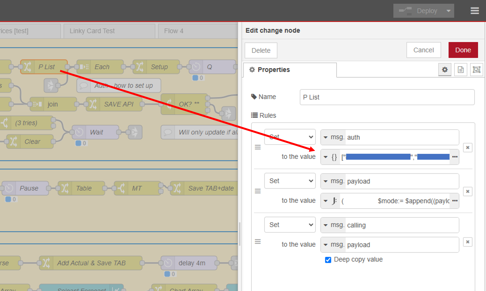

The **API Key** can be found in Solcast in your account section, under 'Your Api Key'. Copy this and enter it into the http request node **API**. Under 'Use Authentication' the Type is '**bearer authentication**' and the Token is the API Key.

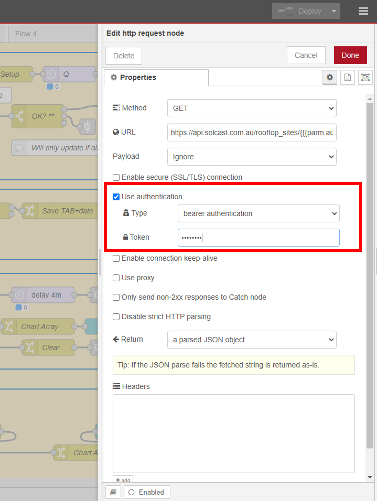

**Your API Key is confidential** and must not be shared. Do not copy this code unless you have first removed the API Key and the Resource Id list.

</details>

**The timezone must be set for the local time to operate correctly.**

<details>
<summary> Setting timezone in Node-RED </summary>

When Node-RED is run as a Home Assistant add-on package, the Node-RED environment is started with an environment variable 'TZ' that contains the Home Assistant machine timezone setting, such as "Europe/Berlin". This is used by the flow to compute the local time and DST changes required, so it is necessary to make sure this is correct.

The flow tab in which the code sits can be edited, and an environment variable 'TZ' added with a valid timezone name, such as 'Europe/London'. The code uses this variable first, then uses the Luxon 'guess' next, following by a hard-coded value in the function node. The value used is reported back in the timezone context variable [solarDST.tzused] so it is easy to check, and it is easy to change the TZ value in the flow for testing or should you wish to run a solar system in a different timezone to the Node-RED machine.

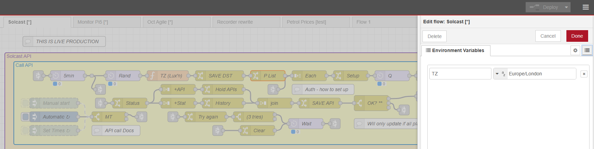

</details>

**Solar horizon has to be defined for the sun-tracking shading to function.**

<details>
<summary> Solar tracking and the horizon </summary>

To provide shading information, the Solar Tracking and Shading flow maintains an array of sun elevation by azimuth. The local site horizon is generated and added to this array and is used to identify periods of time when the site is shaded by the local horizon.

The horizon is auto-generated when the solarSUN context variable is *first* created, and uses an array of horizon points with linear interpolation applied to complete a full 360 degree map of the horizon. Using a simple clinometer and a smart phone, it can be relatively straightforward to obtain a near eye-level view close to the solar plane(s) location, and to map horizon elevation from horizontal by compass bearing. The code accepts a number of data points, assumed to be degrees elevation and equally spaced around the full compass, starting at due north. The number of points provided must be a factor of 360.

The data is coded into an array as a text string of numbers separated by a space. With four array strings, each string represents a 90 degree quadrant. With 18 data points per quadrant the increment is 5 degrees, which is something like:

```json
[
    "20 24 28 32 36 40 44 40 36 32 28 16 16 16 16 16 10 16",
    "16 16 19 19 19 04 04 04 04 16 22 16 16 16 16 16 05 05",
    "05 09 09 09 09 09 18 18 18 17 17 17 06 06 12 11 11 07",
    "10 10 06 06 06 06 06 06 06 06 06 06 06 10 12 14 16 18"
]
```

Fewer data points work well, however the quadrant number must be a factor of 90, hence 2, 3, 5, 6, 9, 10, 15, 18, 30 or 45. If the horizon is ever modified then the context variable solarSUN should be deleted to force a reload (but of course it will take a full 24 hours for the sun-path to repopulate).

</details>

### Connection to Home Assistant

As good practice, the Home Assistant WebSocket nodes have been [scrubbed](https://zachowj.github.io/node-red-contrib-home-assistant-websocket/scrubber/) of their Home Assistant service configuration details, and *additionally disabled*. **You will need to edit these nodes, *and* the node configuration node behind each one, *and possibly the Home Assistant server configuration node itself.***

> [!IMPORTANT]  
> As a *minimum*, you will need to edit the sensor configuration nodes, at least to update and redeploy, in order to reconnect these configuration nodes with *your* default homeassistant server.

<details>
<summary> Connecting to Home Assistant </summary>

- If you are not already running a working connection with Home Assistant, make sure that you have installed the WebSocket nodes in the Node-RED palette, the [Node-RED companion integration](https://github.com/zachowj/hass-node-red) in Home Assistant, and you have correctly configured the *Home Assistant server configuration node*.
  - You should already be able to see a global context variable in Node-RED called `homeassistant` which contains a copy of the Home Assistant state.

In full detail:

- double click each Home Assistant Sensor node in turn to edit
  - enable the node (option bottom left)
  - click the edit pencil next to the *Entity config* entry to edit the ha-entity-config node
  - enable the ha-entity-config node (option bottom left)
  - check the *Server* entry - this should be HomeAssistant or similar
    - if you *do not* have a working HomeAssistant server, use the *Add new server...* option and set up the server
    - if you do have a working HomeAssistant server, ensure this is correctly selected in the *Server* entry field
  - update the *server* node, the *ha-entity-config* node, and finally save the *sensor* node and redeploy the flow once you have updated all the sensor nodes

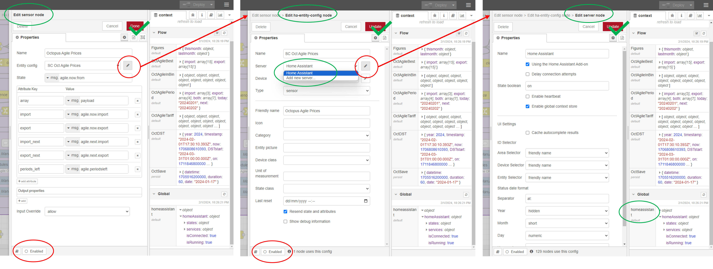

</details>

### Actual solar production

The flow permits the capture of the actual solar production, taken from an appropriate Home Assistant sensor, and covering each half-hour period. The flow uses the **History** node to capture this value automatically, so no additional utility meter sensor is required.

<details>
<summary> Creating a solar energy sensor </summary>

> The value of the **actual solar energy production** recorded by the flow, is measured as the difference in total solar energy over a half-hour period, being the previous half-hour. At 11:00 the history between 10:30 and 11:00 is used to capture the difference in solar energy, and this figure is added to the data table for the period starting 10:30.

Since solar PV inverters record the instantaneous *power*, this must be converted to summed *energy* at some point for our use. Inverters will usually have a *total energy* (since first turned on) figure available, but typically only as whole kWh. Power as watts is also provided, and if this is measured (sampled) frequently enough, this can be used in a **Riemann Sum Integral** integration to sum instantaneous power over time to give energy.

**If you do not already have a solar energy sensor**, use the Home Assistant *Helper* to create a Riemann Sum, based on a solar power sensor. Ensure that the name and flow History node sensor name matches, use your *input sensor* of choice, set precision, metric prefix, and time period as shown. The integration method can be either Trapezoidal (for best results with an input sensor updated several time a minute) or Left (for sensors updated less often).

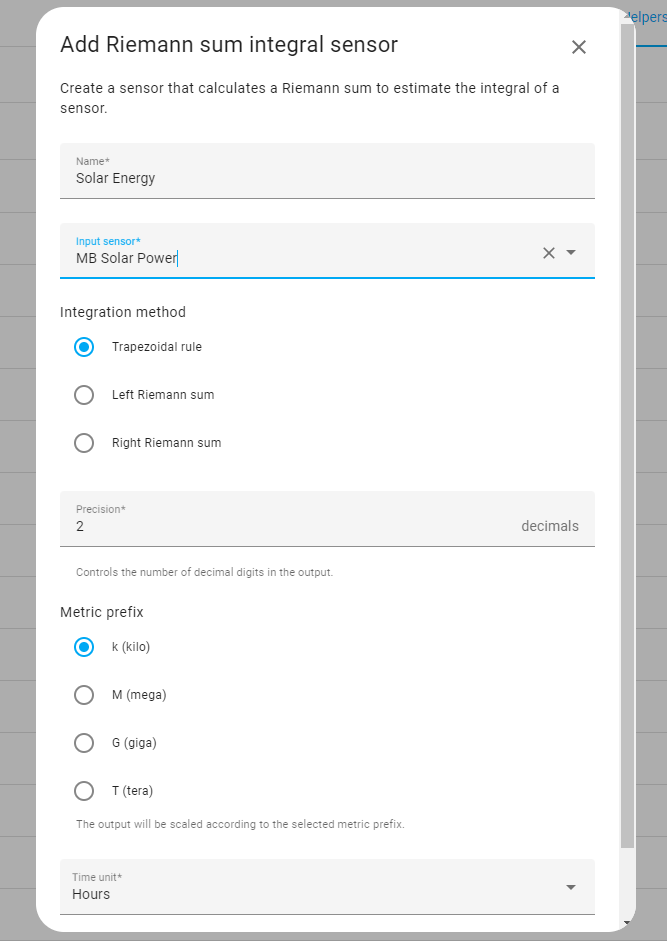

The sensor used to capture actual energy should show an increasing value of kWh to two decimal places, and in Home Assistant should look similar to:

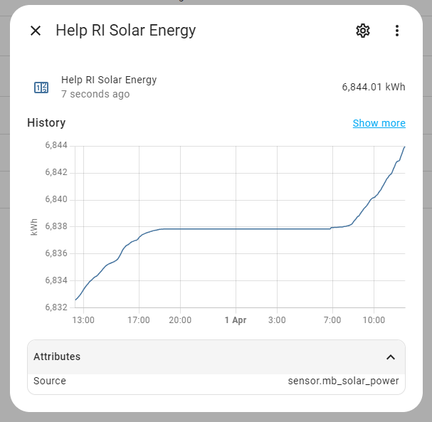

### Matching the solar forecast to actual power

The Solcast solar forecast is a measure of the *average power* expected to be generated for a given *half-hour period*, with the period *ending* at the given timestamp. In contrast, the actual solar value is *energy* (not power) generated over the past half-hour period. To plot both power and energy on the same graph necessitates aligning the two figures as best as possible.

For a given average power over a one-hour period, the power value is numerically identical to the energy value. 1.5 kW for 1 hour equates to 1.5 kWh. Over only half an hour, 1.5 kW equates to 0.75 kWh. Since actual solar is recorded as energy (kWh), when comparing actual to forecast, the actual (energy) must be multiplied by a factor of 2 to align both as *power*. Alternatively, the forecast (power) is divided by 2 to align both as *energy*.

Whilst Solcast provide all forecasts based on average power over a given period, *ending* at the given timestamp, this flow modifies the end-time to be start-time by subtracting 30 minutes for each period. This I find more intuitive to say 'the forecast power will be 750 W at 14:30', although it is more correct to say the average power will be 750 W during the period starting 14:30. Thus a Solcast forecast for 11:30 (forecast from 11:00 to 11:30) is modified to a forecast for 11:00. The actual solar value is captured at 11:30 for the preceding half-hour period, and stored against the period starting 11:00. Experimentation has indicated that, on graph displays, the arrangement used provides the best practical and visual match between actual to forecast *most of the time*.

</details>

### Other optional settings

Complex data structures, such as arrays, are passed to Home Assistant as sensor *attributes*. The Home Assistant Recorder has a capacity limit and *may* generate an error message in the Home Assistant logs, to the effect that an entity state and attributes are too large and are not being saved by the Recorder.

<details>
<summary> Removing recorder error messages </summary>

This flow current passes only summary information and does not include the entire table array in HA sensors, which would certainly generate this error message! The error messages (if they appear) *are advisory* but can be prevented by adding the following to your Home Assistant configuration file. This prevents the Recorder from attempting to save these particular sensors.

```yaml
recorder:
  exclude:
    entities:
      - sensor.solcast_fc_today_total
      - sensor.solcast_daily_graph_table
      - sensor.solcast_regular_update
      - sensor.solcast_update_history
      - sensor.sun_details
```

</details>

<details>
<summary> Solar plane position for Sun Path graph </summary>

The sun path tracker provides details of the current sun path and shading, which is provided in an HA sensor and can be displayed as a graph. The details include the sky-position plot of one or both PV planes. See the Graphs - sun path section for details.

</details>

## Using this Node-RED flow

The flow should run without issue. Solcast does have occasional maintenance outage periods (during Europe night). The flow here has no error checking or recovery - if the API calls fail then the call will be repeated only at the next scheduled trigger point. Rate-limiting errors (429) will be re-attempted [please note that this code feature has not yet been tested in a live situation as at February 2025].

### Questions you might want to ask

<details>
<summary> How and when should I run the flow? </summary>

The flow is setup to run the API calls *only as required* and at pre-determined times. With two planes, the flow assumes that forecasts will be requested for both planes at the same time, and the flow will automatically join these values together. Since the API call limit is 10, it is possible to call for one plane forecast up to 10 times in a 24 hour period. With two planes, each plane-forecast uses up one API call, hence only five calls can be made. If the historical estimates are also required, then for two planes the estimates take two calls, leaving just four opportunities for a forecast call throughout the day.

To avoid running everything at the exact hour, and to avoid flooding the Solcast API, each call adds a random delay from 0 to 20 minutes. *I would encourage you to be considerate to Solcast in your use of this free service.*

Calls are triggered either *manually* by you, by using a *fixed timetable*, or *automatically* between sunrise and sunset.

For the fixed time schedule, set your times in the JSON object in the inject node. Set `"history": ""` if you don't require hind-cast estimates. There is no parameter error checking.

```javascript
{
    "history": "00:00",
    "forecast": [
        "01:30",
        "06:00",
        "10:00",
        "14:00"
    ]
}
```

The automatic schedule [experimental at this state] will attempt to spread the API forecast calls out over the solar day. Again, history can be `""` to turn off.`First_by`will issue one forecast to complete prior to the time given, so if you require a forecast for today before utility energy off-peak period at 02:00, then set this as shown. First-by 00:00 will not work (use 00:30), and if the first-by call falls on or after a time during the solar day, it will not be used. The`plane_count`and`call_limit`figures are used to account for the number of API calls required for the optional history and possible first-by, and then the remaining calls are calculated across the solar day, starting at sunrise. An integer gap of at least one hour is applied, and any calls falling at or after sunset are ignored. If history and forecast are requested at the same time, then two or four API calls will be made for both (forecast and estimates) and should execute correctly.

```javascript
{"history": "03:00",
"first_by": "02:00",
"start_shift": 0,
"plane_count": 2,
"call_limit": 10
}
```

It is necessary for at least one API call to be triggered manually first to generate the DST context variable (used by both fixed and automatic) and for the Home Assistant sensor.sun to update and provide the sunrise and sunset times for the automatic timer [thus this will not work if you are not connected to Home Assistant]. The times are floored to half-hours, and the starting point for automatic times will be sunrise. This start point can be shifted by the`start_shift`parameter, set between `-8` and `8` which moves the start by four hours earlier or later than sunrise. Then end of the time range will always remain at sunset, and therefore the last API call will be the 'spacing gap' time *before* sunset.

</details>

<details>
<summary> What am I getting from the API calls? </summary>

Solcast returns 97 half-hour records for either the forecast or the hind-cast. The first record is for the current half-hour period, and the full array returned extends for 48 hours either forwards in time or backwards in time. The estimates contain just one value, the forecasts three values being the 10, 50, and 90 percentile value.

The flow maintains a set of dates spanning from the day before yesterday to the day after tomorrow. The flow also maintains a full 240 entry array, holding the full five days of 48 half-hour periods. At the first API call of a new day (local time) the array has 48 new records added for the new *day-after-tomorrow*, and the old *day-before-yesterday* is removed.

New values returned by the API call are divided and marked by day, and added to the appropriate half-hour entry. Only non-zero values are processed in order to reduce the processing overhead. Actual values added during the solar night will be added as 0. New API updates do not overwrite the existing figures, but are added to an array of the same day-value group. This provides the latest values at the end of the value-array, and also provides a history of the changes at each API call.

The following shows the data recorded in the day-before-yesterday at 12:00, after five days. There have been 10 API call updates. The 10, 50, and 90 percentile figures are called 'low', 'medium', and 'high'. One update added future records when this date was the day-after-tomorrow. There are a full set of four updates for when this date was 'tomorrow', three from the API calls before 12:00 when this date was 'today'. The hind-cast estimates for this date being 'yesterday' and again when this date was the 'day-before-yesterday'. The actual value has been added, and this value recorded has been multiplied by 2 to equate to power so as to align the energy figure with the forecast half-hour power figures.

```javascript
{
   "2025-01-23 12:00":{
      "date":"2025-01-23",
      "time":"12:00",
      "msec":1737633600000,
      "update":[
         0,
         1737464400000,
         1737509400000,
         1737532800000,
         1737541800000,
         1737550800000,
         1737595800000,
         1737619200000,
         1737628200000,
         1737687600000,
         1737774000000
      ],
      "old_est":362,
      "yes_est":357,
      "tod_med":[
         323,
         309,
         270
      ],
      "tod_low":[
         100,
         94,
         79
      ],
      "tod_hih":[
         629,
         611,
         622
      ],
      "tom_med":[
         257,
         315,
         353,
         317
      ],
      "tom_low":[
         62,
         86,
         100,
         101
      ],
      "tom_hih":[
         590,
         654,
         694,
         623
      ],
      "fut_med":353,
      "fut_low":100,
      "fut_hih":694,
      "actual":340
   }
}
```

</details>

<details>
<summary> Can I save context over a restart? </summary>

It can take up to five days to generate a full set of data, so it is useful to retain this over Node-RED restarts and reboots. All of the context variables can be stored using a *file-based store*. All writes-to and reads-from context are presented in change nodes, allowing for optional and easy visual identification and selection of context store where multiple stores have been configured.

Details on how Node-RED context works can be found [here](https://nodered.org/docs/user-guide/context) and the section 'Using multiple context stores' shows how to setup a file-based store that will survive reboots and restarts. When providing the code in Github as a release, the context stores have all been set as 'default' and it is necessary to edit each and every flow.context_variable read and write. The following lists by group the nodes with flow.context read and writes:

In any situation where the data become corrupt for any reason, one or more of the context variables can be deleted manually and the flow should recreate the necessary variable at the next API call.

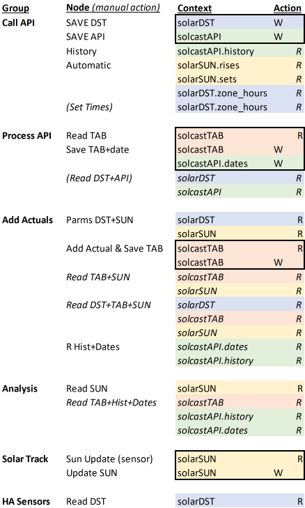

</details>

<details>
<summary> How are local time and DST managed?</summary>

Solcast *only* uses UTC throughout. All time periods are for half-hour, and based on the UTC time at the *end* of the period.

For my own sanity, I like to both use *local* time, and to have the time period defined by the *start* time, not the end time. Thus I can say, for example, that the solar forecast will be for 600 Watts during the half hour *from* 11:00 today. This flow therefore maintains local time, and replaces the Solcast period_end with period_start.

To compute local time and the DST details, the [Luxon library](https://moment.github.io/luxon/#/?id=luxon) is used. The flow uses the machine (Node-RED) timezone setting and will compute an object containing the necessary UTC offset as well as DST changeover points. This works, but with caveats at the DST change, since 'one day' holds either 23 hours or 25 hours accordingly. Although there are some strange DST times out there (Chatham Islands) every geopolitical timezone has at least decided that DST changes will take place at night, and since the sun does not shine at night, DST has little impact on the actual solar forecast value. Ideally you should avoid calling the Solcast API at hours that fall within your local DST change period, or accept that you will miss or duplicate a call on one day each year.

UK users (and other GMT/GMT+1 based timezones) should note that when the clocks go forward, any API calls made between 00:00 and 01:00 will move from taking place on the day, to taking place on the *previous* UTC day [00:00 BST is 23:00 GMT/UTC the day before] and the 'first' call the day after DST change will fail if the full API call allowance is used every day. [I do hope that you are keeping up with this...]

</details>

<details>
<summary> What can I do about shading? </summary>

Shading of solar planes is accounted for in some forecasts by permitting the application of an horizon elevation array. Solcast do not provide this option here, and it is therefore up to the user to account for shade. South facing arrays in open fields or on the roof of two-storey dwellings are unlikely to be impacted by shade. In contrast, east and west facing arrays, and those on single-storey buildings or at ground level may need to consider shade around sunrise and sunset.

This flow provides an independent flow-section for sun-path tracking, which uses the Home Assistant sun-sensor to record elevation against azimuth. This sensor is updated roughly every four minutes during the solar day, and the flow records the rounded integer elevation in an (integer azimuth) 360 entry array. The path interpolates linearly between updates to maintain a full path. An horizon elevation profile can be loaded, and the flow will use the horizon and current sun path to evaluate half-hour time periods where horizon shading occurs for more than 50% (15 minutes) of the period.

The application of shading impact is currently *experimental*, and carried out only in the regular half-hourly forecast update (in node 'Today - regular update'). Solcast provide a 10, 50 and 90 percentile figure for each period, and the flow normally uses the mean or 50 percentile for all forecast computations. During shading periods, the lower 10 percentile figure is used as an *approximation* to the effect of shade. This provides only a limited adjustment. A full shade assessment requires the forecast to be moderated against the full-sun figure rather, than the figures provided where cloud shade and atmospheric conditions are already accounted for. Nevertheless, this approach provides some useful adjustment.

The more critical shading conditions occur during solar winter and for ground mounted and east-west facing planes, particularly when the forecast is for clear sky during the full day. In these situations, horizon shading will have a significant impact that cannot be modelled by using the 10 percentile alone. To potentially assist with creating better shading models, the solar tracking includes sun path span, clear and shaded sky area figures, and sun arc path length, with full path and shaded path figures provided. This information is not currently used, but it is hoped that better models can be developed at some point.

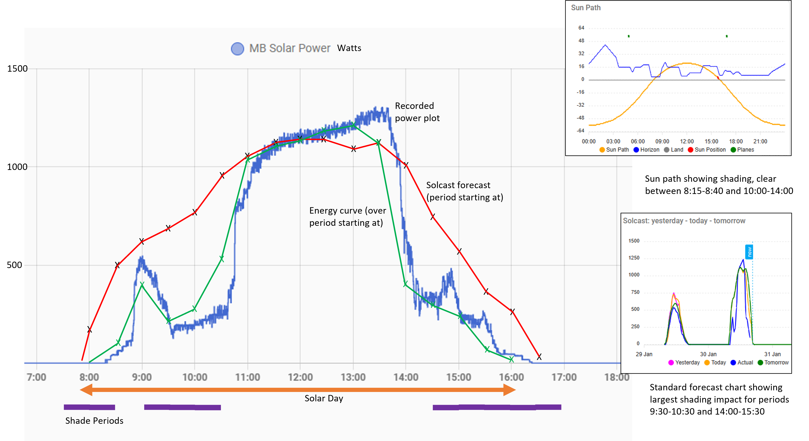

On clear days with full sun, each shaded period could have the forecast value de-rated by 80-85%, however this requires more information than is currently provided to decide when and by how much to apply de-rating. When the ratio of the clear sky to total sky, or the clear sun arc to total sun arc, becomes less than 0.7 it *may* be appropriate to apply *this* ratio to the forecast when a full-sun figure is predicted. For example, during December and January for my own east-west installation, the sun path shows as above, and shading impact is clearly significant. In the most extreme at winter solstice, shading applies fully from sunrise at 08:00 to the 11:30-12:00 period, and then from 14:00 to sunset at 16:30. One plane is ENE on a single storey site, and shading of that plane lasts from sunrise to solar noon, effectively the entirety of the incidental solar period. This curtails output from this plane to just indirect solar, or about 0.3 kWh rather than 1.5 kWh as forecast (for this plane) for a full sun day.

It is left to the user to decide if and how to use the additional shading information provided.

</details>

<details>
<summary> What happens when the forecast is updated during the day? </summary>

A first forecast API call, made before sunrise, will add the values provided to the five-day array covering today and tomorrow. This will provide a base forecast at the time of the call and for the full solar day. Further calls made during the solar day will return values for the part of the day remaining, and these values are layered into the array rather than overwriting the existing figures.

You can see that updates from repeated API forecast calls will change the forecast. General observation suggests that Solcast (at least for myself) operate with a three-hour forward window for a detailed update. An early forecast, for example by 02:00 as a guide to the day-ahead solar generation (to assist setting battery charging schedules) will only provide an indicative value. Updates at the start of the solar day, and at roughly three-hourly intervals up to late solar afternoon, would appear to be a good strategy.

Since the 'day total forecast' is the summation of all the period power values, that is the area under the curve, when updates occur the forecast will change. Again, observation suggests that changes seen in the three-hour forward window are more about time precision of cloud cover than change in the overall cloud cover expected. This means that the overall total for the day remains reasonably static, even if the imminent prediction for the next few hours changes. The curve may go up in one place, and down in another, and only a review of 'yesterday' using a hind-cast will show how good the forecast was. For this reason, I personally would rely on the figure for the total forecast for the day, taken close to sunrise, and rely in moderation on the figure for the next hour or two, and only after a recent update.

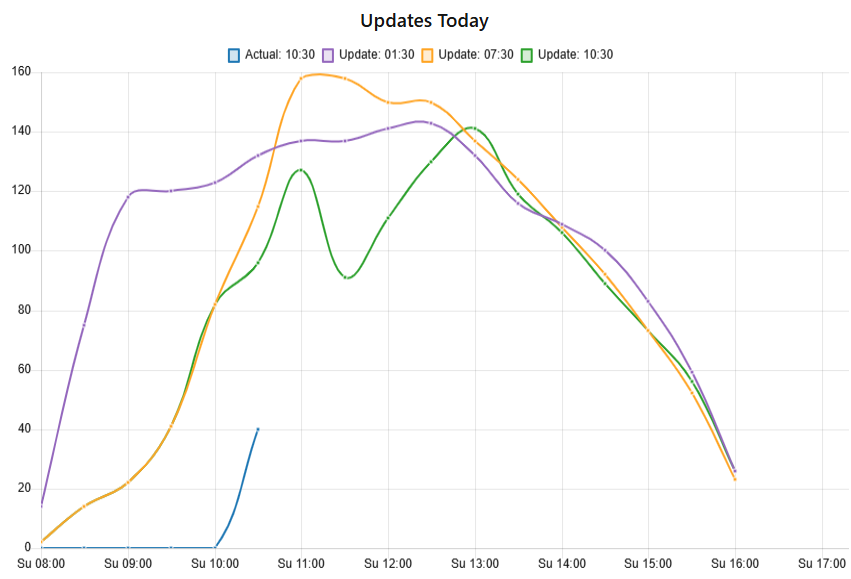

</details>

## Context variables

<details>
<summary> Details of all the flow context variables </summary>

The context store variable reads and writes are all performed in Change nodes. This facilitates more easily selecting a different store than 'default' if you have multiple context stores and wish to make any of the context variables persistent.

### solcastAPI

The solcastAPI variable holds an *object* with the most recent API call results, the five-day dates in use, and the API call history. This is the first step of the API call read-update process, and provides information mostly applicable to debugging failed calls. This holds:

- the most recent raw return, held in one or two fields called FP1 (and FP2) or EP1 (and EP2) for forecasts or estimates (hind-casts) and the one or two planes called. If the API call has been made for *both* forecast and estimates, then two or four fields will be saved, one for each plane and call-type. Each field is an array of 97 period records covering the next / last 48 hours including the current half-hour period
- a history of the calls as an array, up to 50 entries. Each entry holds the type of call, a count within multiple calls expected, retry (429) count, time of call, http status response, 'pass' or 'rate' or 'fail' flag, the count and range of non-zero values returned, and a count of the API calls currently used since UTC midnight
- the dates array of five days with the date and an 'old' / 'yes' / 'tod' / 'tom'/ 'fut' demarcation
- an overall outcome of the call, as "PASS" for success "RATE" or "FAIL", being the worst case of both of two-plane call attempts

The date array is updated and day-shifted at the first API call of the day.

**Note** that the raw return data in this variable has not been processed for local time at this point.

### solcastTAB

Holds the main *array* table of forecasts and hind-casts. There are 240 items for all half-hours over five days. Each array item is an *object* with one field. The field key is a combination of the date and time, as 'yyyy-mm-dd hh:mm'. Entries are in chronological order, hence record 24 will be noon for the day-before-yesterday.

Each entry has fields for:

- date (string), time (string), and Unix millisecond equivalent
- an update array, with the Unix timestamps for each API call update that has been applied to this record. If no updates have yet been applied or if the time period is outwith the solar day, this will be a singleton zero
- a series of fields each holding one or an array of values appropriate for the API call update (these fields will not exist until first written)
  - old_est, single value, for a hind-cast from two-days after the record-day (ie written today)
  - yes_est, single value, for a hind-cast from the day after the record-day
  - tod_med, tod_low, tod_hih, each as one or an array of values for a forecast today returning the median, 10 percentile and 90 percentile values
  - tom_med/low/hih, as one or an array of values for a forecast from yesterday, as above
  - fut_med/low/hih, as one or an array of values for a forecast from the day before yesterday
  - actual, being the recorded actual energy Wh taken over the half-hour period. This, as for the 'update', will be '0' for all records unless and until written to

**Note** that the **forecast** and **hind-cast** figures are Watts *average power*, applicable for the half-hour period. The **actual** figure is Wh total *energy*, recorded for the half-hour period. To align the two requires *either* converting the actual energy to *equivalent average power* by multiplying by 2, or converting the forecast power to *equivalent energy* by dividing by 2. Oh yes it does.

### solarDST

Generated and updated at each API call, this maintains records for the local time offset from UTC as well as full DST change timestamps:

- LCzone (machine) NRzone (Node-RED) tzused (zone used) as timezone eg "Europe/Paris"
- now_loc / now_utc as 'now' from the host machine in the local time and in UTC
- zone_loc / zone_utc as 'now' but with the used timezone applied (thus it is possible to time-shift to another timezone should you wish. Good luck with that)
- for_year (just to make it clear which year I am dealing with, this should change at the new year)
- utc_offset, the minutes time-shift for the given timezone from UTC
- zone_hours, a convenient string version of the offset that can be used directly in JSONata to display the local time from UTC timestamp
- dst_aware /_north /_is_on, will each be`true`if this timezone uses DST, is in the Northern Hemisphere (where the longest solar day is in the *summer*), and if DST is now on (at the *exact* time of the API call)
- dst_details, an *array* of three entries A, B and C each an *object* with
  - period name
  - from and upto times as local, UTC, Unix Seconds
  - applicable timezone UTC offset (minutes) for that period
  - timezone details with name, letters, offset hours, short offset hours
  - mode, as "ON" if DST applies in this period, and "OFF" if standard non-DST applies

**Note** that Period A will always start bang on midnight New Year (local time) and Period C will always end at the last second of the year. Period A end and Period B start will be the same point in time - the local and UTC timestamps will be identical (as will B end and C start) however the Unix Seconds will be 1 second short on the 'upto' time to make all the Unix Seconds times contiguous and not overlapping. Also, for timezones where DST does not apply, the Period A end / B start and B end / C start timestamps will be 'nominal spring / autumn' dates (or autumn / spring for timezones south of the equator).

### solarSUN

This is an *object* maintained separately to Solcast by using the Home Assistant sun.sun entity, and therefore requires connection to Home Assistant to operate. Updates occur when the sensor changes value, which is nominally every four minutes (equivalent to one degree azimuth) during the day, but reduces during twilight and can be 10-20 minutes during the night.

- time (local and UTC) of entity sun.sun update
- timezone offset (minutes) applied
- sun state (above/below horizon) and direction (going up/down)
- local time of sunrise, sunset, and solar noon
- at each update the new and old azimuth and elevation values
- a track *array* of 360 records, each an *object* with
  - azimuth (integer equal to array index)
  - horizon (integer elevation, generated from the horizon settings)
  - fixed time, based on 4 minutes per degree and clock time, based on the local 'now' (for anyone who is interested in the solar equation of time and wishes to record the analemma)
  - elevation (integer rounded)
  - shade flag,`true`if the sun is above zero elevation and at or below the given horizon at this azimuth
- a shade *array*, which will contain all half-hour time periods (staring time as string "hh:mm") where shading is true for more than 50% of the available period. This looks only at the periods actually returned by Solcast and may not include the period between sunrise and the first half-hour if Solcast has not returned a value
- an isshade flag, which is`true`when the sun elevation at the last entity update is between zero and the given horizon elevation

The shade array is (currently only) used in the half-hourly analysis to adjust the forecast, by taking the low 10 percentile value rather than the median 50 percentile value during periods of shade. If no connection can be made to use Home Assistant, or if the sun tracking is not required, the flow should still function correctly without the solarSUN.shade array. Since this array is just a list of times for which the forecast half-hour period should be regarded as being 'in shade', a hard-coded or otherwise-generated array would work just as well. The advantage of the sun-tracking approach is that the sun path is adjusted every day, and can therefore correctly show the near-exact times that the sun will not fall on the site, based on the sun-path updated from yesterday.

</details>

## Analysis and data output

The basic forecast data provided by Solcast is held in the **solcastTAB** context variable. This data set is partially analysed at each half-hour, and more extensively analysed following each successful API call.

<details>
<summary> Analysis overview </summary>

A summary **partial analysis** is composited every half-hour when the actual energy is added to the data table. This looks just at today to build a picture of the cumulative forecast and the progress in actual energy.

**Note** that this analysis applies shading to the today forecast. All forecast analysis uses the median (50 percentile) figure provided by Solcast, but this is adjusted here to use the low or 10 percentile figure *during periods of shade* (applied by half-hour block matched with the solarSUN.shade array). This is annotated as 'Shaded Median' to differentiate from the unmodified median. The impact of this adjustment is limited and mostly applicable to east and west facing planes on partially sunny days.

The **detailed full analysis** following each successful API call runs through a series of computations to provide summary details for:

- the forecast for today in detail
- the forecast for tomorrow
- the forecast for today, based on tomorrow's figures as they were yesterday
- the hind-cast for yesterday and detail of performance
- a summary of the API call updates and forecast changes that have occurred during today
- a summary table of the API call outcomes for today and yesterday

This provides a wide range of information for checking the correct functioning of the forecast operation, for reviewing the accuracy of yesterday's forecast, as well as providing summary and detail on the forecast for both today and tomorrow. Nothing produced from the analysis is retained at this point, but much is made available for passing through to Home Assistant via the sensor state and attribute values.

Any information produced that is *not* required can be either ignored or the relevant node disconnected from the analysis flow. Only 'Updates-Analysis' requires a prior node in the flow sequence ('Today') so there is no consequence in removing unwanted nodes.

Any information required that is not available can be obtained using JSONata, and the analysis stage nodes hold a number of written functions for obtaining a given day of data, and for extracting a particular forecast update. The analysis stage first reads in all the necessary variables from context, and then prepares the data, so this stage can be run at any time between API call updates. The 'actual' solar produced figure is added to the main array every half-hour, and for graphing and detailed analysis purposes, it may be appropriate to re-call the full analysis in between API calls, or at the end of the solar day. All the work done here does add a processing overhead, so consideration should be given to *if*, *when*, and *what* is required beyond that already provided.

</details>

<details>
<summary> Half-hour (Today) Regular Update </summary>

This is produced every half-hour during the full 24 hour day, and will include the latest actual solar energy figures.

- heading: "today", "actuals", date, Unix timestamp, and
- count of forecast API calls that have been applied today, and the hh:mm time of the most recent
- history *array* of today and yesterday API calls, each entry providing date, time, plane count, mode (Forecast / Hind-cast / Mixed) http response, and a count of the number of non-zero records returned
- current *object* (note that the forecast figures are effective power in Watts). This object takes values from the half-hour period in the forecast data for 'now'. Outside of the available records of non-zero forecast values, this object will return "night" for the times, and zeros for all the values:
  - for the current half-hour, the hh:mm time, is-shaded flag, this, last, and next period forecast
  - for the current full hour, time, this, last, and next hour period forecast
  - the last period actual energy recorded (factored to be equivalent Watts)
- values *object*, all total energy as kWh for today:
  - low 10 percentile forecast
  - shaded median forecast
  - median value forecast
  - high 90 percentile forecast
  - actual energy recorded to this point
  - remaining forecast left to end of day
- times *object* holding:
  - dayfrom as first forecast period start time (hh:mm)
  - dayupto as last forecast period end time
  - time of last API update, and also numerical hour including half-hours
  - shade *array* of period start times where shading applies
- analysis information for the forecast:
  - count of half-hour periods in the forecast
  - count of periods where shading applies
  - count of periods where actual energy has been recorded
  - percentage ratio of actual solar to cumulative shaded forecast at this point
  - percentage ratio of actual solar to today shaded forecast for the day
  - peak forecast hour, as start of half-hour period, and peak power forecast
- data array containing all forecast periods for today:
  - time hh:mm, Unix milliseconds
  - low, shaded, median, high forecasts and actual recorded
  - ratio of actual to shaded for the period
  - forecast updated, actual updated, and is-shaded flags
  - cumulative sums of all values to and including this period, for low, shaded, median, high and actual.
  - ratio of cumulative actual to cumulative shaded
  - an indicator of performance "low", "below", "target", "above", "high". This is set for each period given boundaries at low, average of low+shaded, average of high+shaded, and high

The data set here is composed of the *latest* figures in each period. Since the API call updates forecasts from 'now' onwards, forecast updates during the day will not change older values. The best-fit, adopted here, is to take the last (most recent) figure at each period.

</details>

<details>
<summary> Today Analysis (fc_today) </summary>

This is produced following each successful API call (where the forecast will change) and is the only data to also be updated at each half-hour during the solar day (where the actual solar figure will change). The half-hour update of this analysis is only used to refresh the Node-RED graph and is not forwarded to output, although it could easily be used if required.

- heading: "today", "forecast", date, Unix timestamp, and
- forecast day-total kWh values (as the figures from the latest API call update) for
  - low (10 percentile)
  - median (50 percentile) [this is the 'today forecast' figure to be used]
  - high (90 percentile)
- count of API forecast updates, the hour of the last forecast update
- actual solar energy to this point
- data *array* (one item for each API forecast call update)
  - group number, starting from 1
  - update object
    - details of the API call update with date, time, hour, count and type, response, records in the array returned
    - usedup as the count of the API calls made to this point (this includes all forecast/hind-cast calls)
    - state of the update and outcome, which should be "Pass"/"pass"
  - values for low, median, high at, and actual upto, this point
  - array of the full forecast, at this update, each half-hour period with time, Unix milliseconds, and values for low, median, and high for the period
- latest array, as for the data array but only one set of values. Since the updates during the day only change values from the time of the API call update, the 'latest' values are the last available for the full forecast period, and represent the current view of the prevailing forecast

</details>

<details>
<summary> Tomorrow Analysis (fc_tomorrow) </summary>

- heading: "tomorrow", "forecast", date, Unix timestamp, and
- forecast day-total kWh values for tomorrow for low, median, and high
- count of updates and the latest update hour
- data *array* which is identical in format to that produced for the Today Analysis (see above)

**Note** that all forecast API calls executed during a 24 hour day will cover the period for tomorrow in full.

</details>

<details>
<summary> Updates (fc_updates) and History (fc_history) Analysis </summary>

This provides details on the API call updates that have taken place during the day, as an *array* of objects for each successful forecast update. Hind-cast updates are not included.

Each **update** contains details of:

- time (hh:mm) and numeric hour
- state of the update "Pass" for success
- totals of the low, median, high forecast values, and actual solar energy, all as kWh
- statistical information on the 10, 50 and 90 percentile values as
  - range (90 percentile value - 10 percentile value)
  - mean (average of 10 & 90 percentile)
  - sigma (range/2.5 as an estimate)
  - npskew (non-parametric skew) as an indicator of skewness: (mean - median)/sigma

On very sunny days, the 10, 50 and 90 percentiles will all be very close together since there is little expectation of variation in the values. Cloudy days will provide more of a spread, and the median figure will be closer to the 10 percentile if a lower value is anticipated, or closer to the 90 percentile if a higher value is more likely overall. Using spread and skew could therefore provide some insight into how far away the most likely outcome for the day is from the median figure.

The **history** details all the API calls (successful or not) that have taken place today and yesterday, in reverse chronological order. Each entry in the array is an *object* with:

- date, day ("tod" or "yes"), time 'hh:mm', numeric hour, and Unix millisecond
- count of the API calls made at this request
- mode of the call ("Forecast", "Hindcast", "Mixed")
- http response (for two calls will be a combined string "200:200")
- records in the return with non-zero values. For an 8 hour solar day there will be 16 or 17 records for each day, hence the full return will have 32 to 35 records with values out of the full 97 returned
- the 'used up' count of API calls consumed. Note that ratelimiting will generate '429' returns that do no result in a successful update, but will result in a record in the API call history, and that the 'used up' figure will only count the successful calls
- state being "Pass" only if the single or neither of the pair of separate API calls return anything other than 200, "Fail" otherwise
- outcome as the overall state outcome

</details>

<details>
<summary> Yesterday Hindcast Analysis (fc_yesterday) </summary>

Where a hind-cast (estimate) call has been made, the summary analysis for this will be available. This follows the same format as the forecasts for today and tomorrow.

- heading: "yesterday", "hindcast", date, Unix timestamp, and
- hindcast estimate day-total
- actual energy day-total kWh
- ratio as percentage of the actual / estimate
- count of updates and the latest update hour
- data *array* which is similar in format to that produced for the Today Analysis (see above). The figures provided in the data.array for each half-hour period include
  - the estimate 'est' as the average power
  - the estimate Wh 'ewh' being half the power value
  - the actual energy as Wh
  - the numerical difference

In general there will only be one estimate called each day, hence the data array will contain only the one group.

The ratio figure given here is a measure not of the forecast accuracy, but rather the accuracy of the Solcast setup and how well your solar PV system responds to the available sunlight. Discounting the effects of shading, the ratio actual/estimate should be close to 100% each day.

</details>

<details>
<summary> Today from Yesterday Analysis (fc_todayest) </summary>

For completeness, the figure for the 'tomorrow-forecast' is taken from yesterday and provided as an adjunct to the forecast for today. Since 'tomorrow' as it looked like yesterday is now today, this figure can be used to see how today's forecast changed overnight, and therefore how reliable 'tomorrow' is likely to be in general.

The values provided are almost identical to those for Today, but as "tom-yes" and "forecast", and with just one data array object, being the last update group of the day.

</details>

<details>
<summary> Yesterday Forecast Analysis (fc_yesterday_forecast) </summary>

This analysis looks at the today-forecast from yesterday in summary detail to compliment both the half-hourly update and the Today Forecast (from today) and provides a snap shot of performance at each API call update.

Along with the usual header information as "yesterday" and "forecast" is an *array* (by API call update) of

- median, shaded, actual day-total kWh values
- ratio actual/shaded
- count of API call updates (forecast) and the final update hour

This permits a view of how the forecast has changed during the day. Since the actual solar changes during the day, the value of actual solar energy is the final one from the end of the day. This data may provide a better insight into forecast accuracy, dependent on such factors as the time of day of the update call, and how successful the shading application is.

Again it should be clearly noted that since the forecasts only affect the periods *at and following* the API call period, progressive forecast updates have to either assume that previous periods are not affected, or each forecast update would also require a corresponding hind-cast estimate call, so as to be able to replace now-historical forecast values with better hind-cast estimates to mach the better forecasts. Since Solcast API calls are limited to just 10 per day (at the time of writing) such an approach for two-plane system would permit only two daily forecast & hind-cast group calls (one call and one update). With just one plane, up to five separate forecast & hind-cast group calls could be made, so there is the possibility in the future of improving both immediate reporting and later analysis to take this into account.

</details>

## Home Assistant Sensors

Several Home Assistant sensors are provided for passing *state* and *attribute* values to Home Assistant. These are updated at various times, and are *examples* of the data that can be passed to Home Assistant. Although entirely useable 'as is', there is great flexibility for changing sensor values to suit particular requirements.

<details>
<summary> SolCast FC Today Total </summary>

This is updated after each *successful* API call.

The *state value* is the forecasted day total (kWh) for today as the sum of the median forecast values.

**Note** that this sensor will carry forward the value from yesterday *until* the first successful API call of the new day. If (and only if) the first call is for estimates only, then the today-forecast for today will not exist and the sensor state will be set to zero.

Attributes hold:

- the forecast that was the forecast for tomorrow generated from yesterday's figures (since *today* is what *tomorrow* was *yesterday*, just in case you are interested...)
- the forecast for tomorrow, if data for tomorrow exists
- the hind-cast for yesterday (Solcast estimates of what actually happened)
- a ratio for yesterday, as *actual* energy generated yesterday, divided by yesterday *hind-cast* total energy
- the shade array

**Note** that the yesterday-ratio calculation uses the **hind-cast** (estimates) returned by Solcast and not the "what was forecast for 'today' yesterday". This gives the *best-possible* ratio, since Solcast will return for a hind-cast the *best-estimate* of the historic-forecast, given everything now known. This figure should therefore be close to 100%.

The difference between the Solcast *forecast for today* and the (estimate) *hind-cast provided the day after*, is mostly the *error in the Solcast forecast*.

The difference between the Solcast *hind-cast for yesterday*, and what was recorded as the *actual energy generated yesterday* is the combination of errors in:

- Solcast hind-casting
- settings for the system in Solcast [eg you set plane elevation as 35 degrees but it is actually 37]
- system performance [eg peak should be 2kW on the plane, but it is covered in dirt]
- measurement errors [eg you are recording solar energy using a Riemann integral using the 'right-value' rule]
- shading [eg Solcast assumes the sun shines on your plane, in actual fact your neighbour's climbing rose is growing over a panel]

Long term monitoring of the ratio 'forecast yesterday' to 'hind-cast for yesterday' will show how good Solcast forecasts are.

Long term monitoring of the ratio 'actual-yesterday' to 'hind-cast for yesterday' will provide insight into the above errors.

</details>

<details>
<summary> SolCast FC Update History </summary>

The *state value* is the **count of forecast** updates (API calls) that have taken place. This includes only successful API calls and only forecasts. When this count is 0 it means that there have been no forecast updates for today. Note that this sensor is updated only on API calls and is *not* cleared at midnight!

Attribute fields hold:

- the updates *array*, each item being the:
  - string hour eg '01:30' and numeric hour eg 1.5 for an API call update
  - state (always 'Pass' since only successful updates are included here)
  - numeric kWh forecast values for low, median, high, actual solar
  - estimated range, mean, sigma, and non parametric skew
- the history *array*, each item being the:
  - date string
  - day 'tod' for today and 'yes' for yesterday
  - update time 'hh:mm' and numerical hour
  - Unix millisecond time
  - count of planes in the update
  - mode of the update (Forecast, Hindcast, Mixed)
  - http response (success will be '200:200' for two planes)
  - count of non-zero records in the return
  - usedup count as number of API calls now used
  - state and outcome, which will be Pass or Fail

</details>

<details>
<summary> SolcastRegular Update </summary>

This sensor is updated every half-hour during the full 24 hour day. The *state value* is the 'hh:mm' string for the start time of the current *live period*. Only periods with a non-zero forecast value are considered 'live', and at other times this state will be the string 'night'.

Attribute fields hold:

- a count of forecast updates
- an 'is-shaded' flag, true if the current period is in the shaded array
- the last / this / and next as forecast (power Watts) for the half-hour period
- the last / this / and next as forecast for the inclusive full hour (eg period starting 10:30 to 11:00 will include the full hour 10:00 to 11:00, last as 09:00 to 10:00 and next as 11:00 to 12:00)
- shaded-median forecast energy figure (kWh) for the day
- actual solar energy (kWh) sum up to the start of this period
- the remaining forecast energy (sum of forward periods not including this one)
- solar-cumulative-percent value, as the ratio of current total actual solar energy to sum of all forecasts to this point: 85 means that actual solar energy so far is 85 percent of the forecasted value to this point in time
- solar-day-percent value, as the ratio of current total actual solar energy to the entire day forecast

</details>

<details>
<summary> Solcast Table (Graph) </summary>

This sensor provides the necessary *arrays* for plotting the forecast using ApexCharts in Home Assistant. The state value is a 'now' timestamp.

Attribute fields hold separate *arrays* for:

- Unix millisecond times
- matching time-values for yesterday, today, tomorrow, and actual power

**Note** that the forecast values are for the average power for the period starting at the timestamp, and the actual solar PV energy values have been adjusted to match as equivalent *power* values.

</details>

<details>
<summary> Daylight Saving Time Details </summary>

This sensor is updated only every Sunday morning (which should be just after any DST time change as they frequently take place on Sunday by 03:00) and holds the basic DTS information.

State value is the local timestamp string, at the point when the DST details were last updated.

Attribute fields hold:

- the current year
- utc offset (minutes)
- DST-on Boolean flag
- ISO timestamps (as UTC) for the DST *start* and *end* times (or DST end and start in the Southern Hemisphere)

</details>

<details>
<summary> Sun Details </summary>

This sensor is updated every time the HA sun sensor updates (~4 minutes daytime and ~10-20 minutes nighttime) when the flow recalculates the sun position array. The state value is the current sun 16-point compass position string, eg 'SSW'

Attribute fields hold:

- an array of the sun details, suitable for an Apex Chart graph
- the sun-span for today, as ratio of sunrise to sunset azimuth / 180. Will be 1 at either equinox
- peak elevation of the day (equates to elevation at solar noon)
- visible sun area, being the summed area under the sun path, for the:
  - full path, down to zero elevation
  - area between the path and the given shade-horizon
  - area between the path and shade-horizon remaining in the day
- a shaded Boolean flag, true if the sun is between 0 and the shade horizon
- visible sun path arc length, being the approximate arc length for the sun path:
  - between sunrise and sunset
  - where the sun is not shaded
  - where the sun is not shaded for the path remaining in the day

</details>

## Display - Graphs and Tables

### Graphs

The flow includes three **Node-RED dashboard graphs**. The full five day forecast, the cumulative total for the day, and the forecast update for today by each API call update.

<details>
<summary> Five Day Graph </summary>

The full five day graph is generated from the half-hour update and is refreshed every half-hour to show the available forecasts and hind-casts, with the updated actual solar recorded.

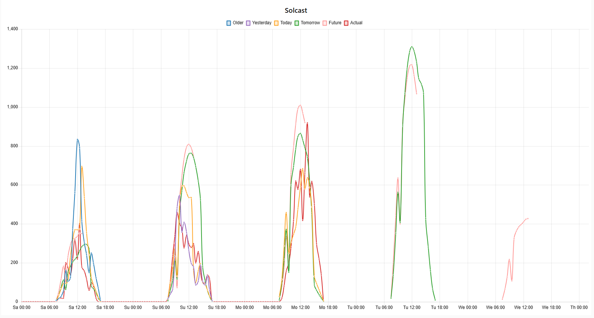

</details>

<details>
<summary> Cumulative Graph </summary>

The cumulative graph is generated from the half-hour update, but only updated every half-hour during the solar day (including civil twilight). This shows the cumulative sum of the total kWh *energy* at each half hour for the low, shaded median, and high forecast predictions, together with the actual solar PV energy.

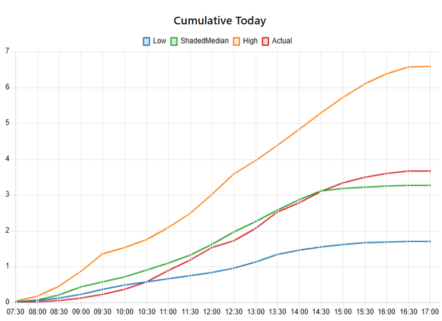

This particular example, from a variable cloudy day in early spring, demonstrates the wide range between the best and worst forecast. On a clear sunny day the best total day forecast for this day would be close to 7 kWh, but if the day is entirely cloudy this would be only 2 kWh. With variable cloud, the spread between best and worst cases is much wider. The flow uses the median, with adjustment for shading by taking the lower forecast during periods of shade. This example demonstrates how closely the actual solar *normally* follows the median, ending the day around 90-110 percent of the final median value.

</details>

<details>
<summary> Updates Graph </summary>

The updates graph is generated from the detailed analysis for the today-forecast (fc_today). This is updated at every successful API call, and also every half-hour during the solar day (including civil twilight).

The graph plots the various API call update *power* forecasts and shows the forecast average power at each half hour period. Each update is shown in entirety, and also the actual solar PV power equivalent taken from the actual energy readings. The series labels are auto-generated with the update time, as is the actual solar power.

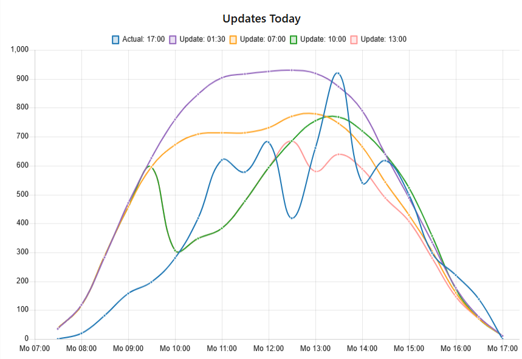

This particular example demonstrates the challenges of obtaining a good forecast with only limited API calls. The update plots will only appear following a successful API call, so in this case the first arrives between 01:30 and 02:00, and is thus labeled as the start of the half-hour period to which it relates.

The next update occurs for 07:00, with minor changes. This is followed by the 10:00 update, which will provide changed details for the 10:00 half-hour period onwards, hence the update-curve retains older figures and can only adjust the forecast from 10:00. The same occurs for the final 13:00 update.

</details>

**For display in Home Assistant**, I use the custom [apexcharts-card](https://github.com/RomRider/apexcharts-card)

<details>
<summary> Forecast graph configuration </summary>

The graph configuration used here shows the forecast figures over a complete 3 day period for 'yesterday', 'today' and 'tomorrow'.

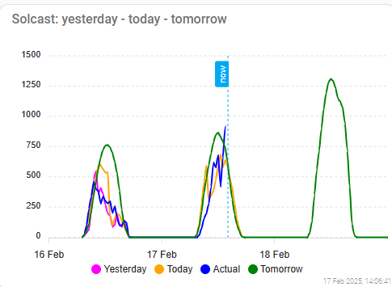

Card settings:

Graph_span is set to 3 days, with span to end at the end of the day offset by +1day so the graph runs from yesterday to tomorrow in full. The yaxis has been set to a value of 1500 (W) as I have been using the graph alongside another forecast graph and required a visual match. Other settings are available.

Data series are all a smooth line, using a data generator. This takes the *attributes.time* array for the timestamp and mapping to each value array required for the chart.

Configuration code is given below:

```yaml
type: custom:apexcharts-card
graph_span: 3d
span:
  end: day
  offset: +1d
header:
  show: true
  title: "Solcast: yesterday - today - tomorrow"
yaxis:
  - min: 0
    max: ~1500
    apex_config:
      tickAmount: 6
now:
  show: true
  label: now
show:
  last_updated: true
series:
  - entity: sensor.solcast_daily_graph_table
    data_generator: |
      return entity.attributes.time.map((fchr, index) => {
        return [new Date(fchr).getTime(), entity.attributes.yesterday[index]];
      });
    curve: smooth
    name: Yesterday
    show:
      in_header: false
      legend_value: false
    stroke_width: 2
    color: magenta
  - entity: sensor.solcast_daily_graph_table
    data_generator: |
      return entity.attributes.time.map((fchr, index) => {
        return [new Date(fchr).getTime(), entity.attributes.today[index]];
      });
    curve: smooth
    name: Today
    show:
      in_header: false
      legend_value: false
    stroke_width: 2
    color: orange
  - entity: sensor.solcast_daily_graph_table
    data_generator: |
      return entity.attributes.time.map((fchr, index) => {
        return [new Date(fchr).getTime(), entity.attributes.actual[index]];
      });
    curve: smooth
    name: Actual
    show:
      in_header: false
      legend_value: false
    stroke_width: 2
    color: blue
  - entity: sensor.solcast_daily_graph_table
    data_generator: |
      return entity.attributes.time.map((fchr, index) => {
        return [new Date(fchr).getTime(), entity.attributes.tomorrow[index]];
      });
    curve: smooth
    name: Tomorrow
    show:
      in_header: false
      legend_value: false
    stroke_width: 2
    color: green
```

**Note** that for Home Assistant dark display modes, other colours might be more appropriate.

</details>

<details>
<summary> Sun path </summary>

The sun path graph provides a visual display of the position of the sun, and is updated every time HA updates the sun sensor.

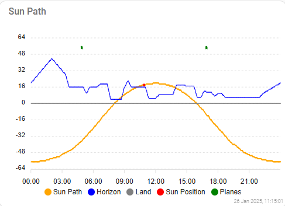

This is stand-alone code, so it could be used anywhere and just for fun. At my latitude (London UK) the sun elevation moves quite considerably during the year, and the horizon mapping shows clearly the shading experienced during the winter months.

The horizon comes from the loaded horizon table, and the solar planes are marked at the point in the sky at the perpendicular to the plane. This setting can be found in the Update SUN node in the Solar tracking group, and is an array of arrays.

For example: [[80,35],[250,35]] - for two planes, azimuth 80 and 250 degrees with due North 0, and for a plane elevation of 35 degrees.

Card configuration code is given below:

```yaml
type: custom:apexcharts-card
span:
  end: day
header:
  show: true
  title: Sun Path
yaxis:
  - min: -64
    max: 64
    apex_config:
      tickAmount: 8
now:
  show: false
  label: time
show:
  last_updated: true
series:
  - entity: sensor.sun_details
    data_generator: |
      return entity.attributes.grapharray.time.map((time, index) => {
        return [time, entity.attributes.grapharray.sunpath[index]];
      });
    curve: smooth
    name: Sun Path
    show:
      legend_value: false
    stroke_width: 2
    color: orange
  - entity: sensor.sun_details
    data_generator: |
      return entity.attributes.grapharray.time.map((time, index) => {
        return [time, entity.attributes.grapharray.horizon[index]];
      });
    curve: smooth
    name: Horizon
    show:
      legend_value: false
    stroke_width: 1
    color: blue
  - entity: sensor.sun_details
    data_generator: |
      return entity.attributes.grapharray.time.map((time, index) => {
        return [time, 0];
      });
    curve: smooth
    name: Land
    show:
      legend_value: false
    stroke_width: 1
    color: grey
  - entity: sensor.sun_details
    data_generator: |
      return entity.attributes.grapharray.time.map((time, index) => {
        return [time, entity.attributes.grapharray.sunnow[index]];
      });
    curve: smooth
    name: Sun Position
    show:
      legend_value: false
    stroke_width: 4
    color: red
  - entity: sensor.sun_details
    data_generator: |
      return entity.attributes.grapharray.time.map((time, index) => {
        return [time, entity.attributes.grapharray.plane[index]];
      });
    curve: smooth
    name: Planes
    show:
      legend_value: false
    stroke_width: 4
    color: green
```

</details>

### Tables

Much of the data provided comes in *arrays* of values. One easy way to display array data is using tables. I use the custom component [flex-table-card](https://github.com/custom-cards/flex-table-card), which can easily display a sensor attribute array as a table.

<details>
<summary> API call history and forecast updates as tables </summary>

The API call history and the Forecast Updates are ideal as tables. Note here the hind-cast API call failed to execute correctly. Without a recorded trace on the API history this failure would be impossible to identify and debug.

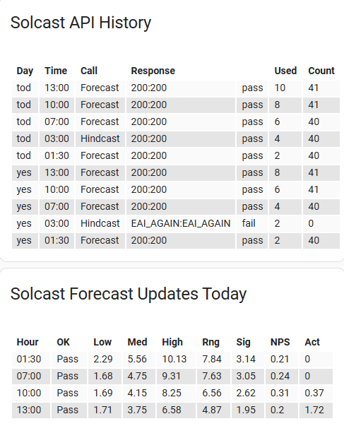

Here is the code required for the API history:

```yaml
type: custom:flex-table-card
title: Solcast API History
entities:
  include: sensor.solcast_update_history
columns:
  - data: history
    modify: x.dayis
    name: Day
  - data: history
    modify: x.utime
    name: Time
  - data: history
    modify: x.modes
    name: Call
  - data: history
    modify: x.response
    name: Response
  - data: history
    modify: x.outcome
    name: ""
  - data: history
    modify: x.usedup
    name: Used
  - data: history
    modify: x.records
    name: Count
```

And for the Update results:

```yaml
type: custom:flex-table-card
title: Solcast Forecast Updates Today
entities:
  include: sensor.solcast_update_history
columns:
  - data: updates
    modify: x.update
    name: Hour
  - data: updates
    modify: x.state
    name: OK
  - data: updates
    modify: x.low
    name: Low
  - data: updates
    modify: x.median
    name: Med
  - data: updates
    modify: x.high
    name: High
  - data: updates
    modify: x.range
    name: Rng
  - data: updates
    modify: x.sigma
    name: Sig
  - data: updates
    modify: x.npskew
    name: NPS
  - data: updates
    modify: x.actual
    name: Act
```

</details>

## Trouble shooting

If you are having problems...

<details>
<summary> Basic trouble shooting guide... </summary>

### It does not work

**The API call?** You can always go to your Solcast account and generate a view of the current forecasts for your one or two resources. This produces nice graphs for visual checking, but it does use up API calls.

**The entities in Home Assistant?** Check your Node-RED Home Assistant server configuration.

### Forecast power is widely incorrect

Check using the Solcast account. If it does not look right there, check your settings.

### My actual does not line up with the forecast

Call for and check the hind-cast estimates for yesterday. Examine the graph - the start and end should match the solar day at the very least. Peaks and troughs should mimic, even if they are misaligned by half to a couple of hours either way.

### The day forecast total is not accurate

It is a *forecast*, and you should only expect an accurate forecast and a good match to your actual solar generation on cloudless sunny days. The clear-sky prediction (with the correct parameters) on sunny days will be sound.

After that, weather happens. Solar generation is roughly 15% of system peak from diffuse light, and 85% from direct incident sunlight. Particles and moisture in the atmosphere reduce, and dark cloud can block both direct and diffuse sunlight. Shading on any part of an array can have a major impact without micro-inverters.

Note that, the further away from south a solar plane faces, the more unreliable the forecast becomes. Planes that face more northerly from direct east or west appear to be particularly unreliable at the start or end of the solar day.

### I want the code to do something else

I plan on *possibly* refactoring on a yearly-ish basis (sooner if the whim takes me) but there is nothing to stop you having a go!

</details>

## JSONata

Is a very different language, so if you are looking to either understand the code used here, or to make modifications, then you are almost certainly going to have to learn a bit about JSONata.

The JSONata documentation can be found [here](https://docs.jsonata.org/overview.html)

There is a great [sandbox](https://try.jsonata.org/) which I use for all my development work.

An alternative JSONata primer can be found [here](https://zachowj.github.io/node-red-contrib-home-assistant-websocket/guide/jsonata/jsonata-primer.html)

## Declaration

This code was written for fun and personal enlightenment only.
I have no commercial interest or associations. No suitability, guarantee, or warranty is provided whatsoever.
At no point was AI used, either for the code or for this documentation.
This code works for me. It may not work for you, or it may stop working at some point in the future due to circumstances.
